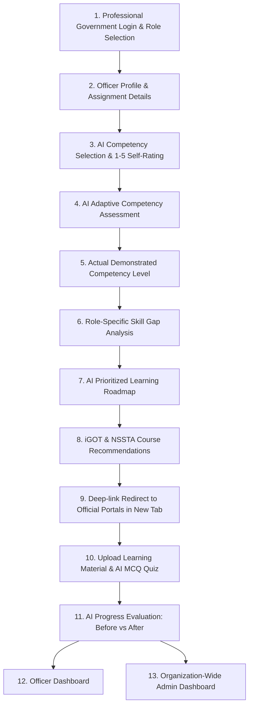

# सामर्थ्य सांख्यिकी • Samarthya Sankhyiki
### AI-Enabled Learning and Competency Platform for India's Official Statistical System
**Official Solution for Smart India Hackathon (SIH 2026)**
*Ministry of Statistics and Programme Implementation (MoSPI) • National Statistical Systems Training Academy (NSSTA) • iGOT Karmayogi Bharat*

---

## 🏛️ Project Overview

**Samarthya Sankhyiki** is an AI-powered national competency framework and capacity-building ecosystem built specifically for officials working in India's Official Statistical System (ISS / SSS cadres, NSSO, NAD, ESD, DQAD, and State Directorates of Economics and Statistics).

Unlike generic Learning Management Systems (LMS), this platform strictly implements the **Role-Based Competency Model**:
$$\text{ROLE} \longrightarrow \text{REQUIRED COMPETENCIES} \longrightarrow \text{ACTUAL COMPETENCY} \longrightarrow \text{SKILL GAP} \longrightarrow \text{PRIORITY} \longrightarrow \text{COURSE RECOMMENDATION}$$

Two officers in different assignments (e.g. Labour Statistics vs Data Science Cell vs Price Indices) **never receive the same competency requirements or roadmap**.

---

## 🚀 Key Architectural Modules

| # | Module / Page | Purpose & Technical Highlight |
|---|---------------|--------------------------------|
| **1** | **Government Portal Login** | Role-based authentication (Officer vs Administrator) with 1-click presets for realistic SIH personas. SSO-ready architecture for Jan Parichay & MeriPehchaan. |
| **2** | **Officer Details & Assignment** | Flexible organizational structure (no rigid Dean/HOD hierarchy). Collects Designation, Department, Job Role, Current Assignment (PLFS, CPI, ASI, NAD), Education, and Prior Trainings. |
| **3** | **AI Competency Selection & Self-Rating** | Filters from the 24 official competencies across 4 domains (Statistical, Technical, Digital Governance, Managerial). Only presents 5–7 role-critical competencies. Officers self-rate 1–5 (with explicit notice that self-rating is not final competency). |
| **4** | **AI Adaptive Competency Assessment** | Question difficulty dynamically branches based on self-rating and response correctness (Level 1 Foundational, Level 2 Operational, Level 3 Advanced). Realistic Indian statistical scenarios (NSSO, PLFS, CPI, ASI). |
| **5** | **Actual Demonstrated Level** | Psychometrically calculates demonstrated competency (Beginner, Intermediate, Advanced) and presents the 3-step paradigm: *What you thought* ➔ *What the test measured* ➔ *What you demonstrated*. |
| **6** | **Role-Specific Skill Gap Analysis** | Compares Required Level for Assignment vs Actual Demonstrated Level. Classifies gap severity (HIGH, MEDIUM, NONE), highlights weak areas, and justifies role criticality. |
| **7** | **Personalized Learning Roadmap** | AI sequences learning milestones using multi-factor prioritization (Gap Severity 40% + Assignment Criticality 30% + Training Deficit 15% + National Priorities 15%). |
| **8** | **iGOT & NSSTA Course Recommendations** | Ranked programmes from iGOT Karmayogi Bharat and NSSTA Greater Noida. Clicking **"Start Course"** opens verified official portal URLs directly in a new tab without simulated players. |
| **9** | **Document Upload & AI MCQ Evaluation** | Post-learning module. Officers upload PDF/TXT/DOCX training notes. AI extracts core concepts, generates validation MCQs, grades answers with explanations, and evaluates **BEFORE vs AFTER competency growth**. |
| **10** | **Officer Dashboard** | Personal command center showing Statistical Readiness Index, active roadmap milestones, hours logged, competency meters, and growth trajectories. |
| **11** | **Admin Intelligence Dashboard** | Organization-wide intelligence for Director General & MoSPI leadership. Features national competency distribution (Strong/Medium/Weak %), gap frequency alerts, department-wise heatmaps, filters, and CSV report export. |

---

## 🔄 End-to-End Workflow Diagram



---

## 👥 Distinct Demo Personas (Role Personalization Proof)

The platform includes pre-configured realistic profiles demonstrating that **different officers receive completely different roadmaps**:

1. **Officer A: Smt. Priya Sharma (Statistical Officer)**
   - *Department:* Survey Design & Research Division (SDRD), Kolkata
   - *Assignment:* Labour Statistics & Periodic Labour Force Survey (PLFS)
   - *AI Selected Competencies:* Labour Statistics, Sampling Techniques, SQL, Survey Design, Data Quality Frameworks.
   - *Identified Gaps:* SQL (HIGH), Sampling (HIGH).
   - *Roadmap Priority:* 1. Advanced Sampling Techniques (NSSTA) ➔ 2. Relational Querying of NSSO Microdata (iGOT).

2. **Officer B: Shri Rajesh Kumar (Technical / Data-Oriented Officer)**
   - *Department:* Data Quality Assurance Division (DQAD), Kolkata
   - *Assignment:* Big Data & AI Analytics Cell for Anomaly Detection
   - *AI Selected Competencies:* Python, AI/ML, SQL, APIs, Data Visualization, Cybersecurity.
   - *Identified Gaps:* Python (HIGH), AI/ML (HIGH).
   - *Roadmap Priority:* 1. Python Statistical Automation (iGOT) ➔ 2. Applied AI/ML in Official Statistics (NSSTA).

3. **Officer C: Dr. Amitava Roy (Leadership / Management-Oriented Officer)**
   - *Department:* Economic Statistics Division (ESD), New Delhi
   - *Assignment:* Price Statistics & CPI Modernization
   - *AI Selected Competencies:* Leadership, Project Management, Communication, Ethics, Data Privacy.
   - *Identified Gaps:* Leadership (HIGH), Project Management (HIGH).
   - *Roadmap Priority:* 1. Public Leadership (iGOT) ➔ 2. Project Management for Censuses (NSSTA).

4. **Administrator: Shri V. K. Malhotra (Director General)**
   - Access to macro intelligence, department heatmaps, training alert feeds, and CSV export.

---

## 🔌 Integration Architecture (iGOT Karmayogi & NSSTA)

```
server/
  ├── services/
  │   ├── igotService.js          # iGOT Karmayogi Bharat catalogue & direct deep-link layer
  │   ├── nsstaService.js         # NSSTA Greater Noida training calendar integration
  │   ├── courseRecommendationService.js # Explainable AI recommendation engine
  │   ├── adaptiveAssessmentService.js   # Dynamic 3-tier difficulty brancher
  │   ├── learningMaterialService.js     # Text parser & MCQ concept generator
  │   └── aiProvider.js           # Dual-mode engine: Google Gemini Live or Statistical AI Engine
```

### Environment Configuration (`.env` or `.env.example`):
```env
# Server
PORT=5000
AUTH_SECRET=mospi_capacity_building_sso_secret_2026

# AI Engine (Set AI_API_KEY for live Gemini, or leave blank to use built-in Statistical AI)
AI_PROVIDER=statistical-ai-engine
AI_API_KEY=
GEMINI_MODEL=gemini-1.5-flash

# iGOT Karmayogi Bharat Official Integration Layer
IGOT_BASE_URL=https://www.igotkarmayogi.gov.in
IGOT_API_BASE_URL=https://api.igotkarmayogi.gov.in/v1
IGOT_CLIENT_ID=
IGOT_CLIENT_SECRET=
IGOT_API_KEY=

# NSSTA / TPAC Training Academy Integration Layer
NSSTA_BASE_URL=https://www.nssta.gov.in
NSSTA_API_BASE_URL=https://api.nssta.gov.in/v1
NSSTA_API_KEY=
```

> **Note on Government Credentials:** Government SSO and internal API keys require department authorization. The system is designed with a production-ready integration layer running on verified official course catalogues. Credentials can be plugged into `.env` without modifying application code.

---

## 🛠️ Installation & Quick Start

### Prerequisites
- **Node.js**: v18+ (tested on Node v24)
- **npm**: v9+

### 1. Clone & Install
```bash
# Install root dependencies
npm install

# Install server dependencies
cd server && npm install && cd ..

# Install client dependencies
cd client && npm install && cd ..
```

### 2. Run Fullstack Application
From the root directory, execute:
```bash
npm run dev
```
This runs both:
- **Backend Express Server:** `http://localhost:5000`
- **Frontend Vite Application:** `http://localhost:5173`

Open your browser and navigate to:
👉 **`http://localhost:5173`**

---

## 🧪 Automated Verification & Testing

Run the end-to-end pipeline test script:
```bash
node test_pipeline.js
```
This validates all 13 core REST endpoints:
1. System Health & Integration Checks
2. Role-Based Login
3. Officer Profile CRUD
4. AI Competency Filtering
5. Self-Rating Calibration
6. Adaptive Assessment Session Initialization
7. Live Adaptive Branching & Scoring
8. Skill Gap Analysis (Required vs Actual)
9. Prioritized Learning Roadmap Generation
10. Official Course Recommendations with Deep-Links
11. Document Upload & Concept Extraction
12. Before vs After Progress Evaluation
13. Organization-Wide Admin Analytics

---

## 🛡️ Security & Governance Compliance

- **Role-Based Access Control:** Strict boundary separation between Officer and Administrator dashboards.
- **Backend Secrets Isolation:** All API keys and connection tokens reside exclusively in backend environment variables.
- **Upload Validation:** Strict MIME-type checking, 10MB file size ceiling, and safe file parsing.
- **DPDP Act 2023 Alignment:** Anonymized microdata handling principles embedded across assessment modules.
- **Explainable AI:** Recommendations include transparent audit rationales explaining *why* each course was prescribed.
# sih-2026

